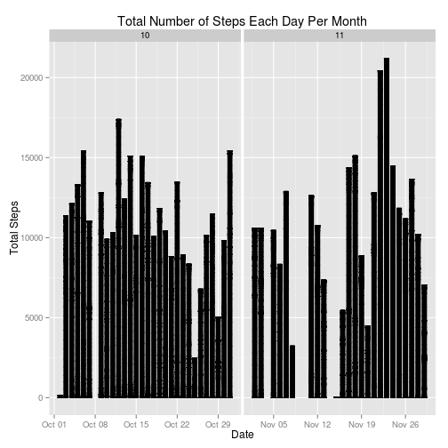
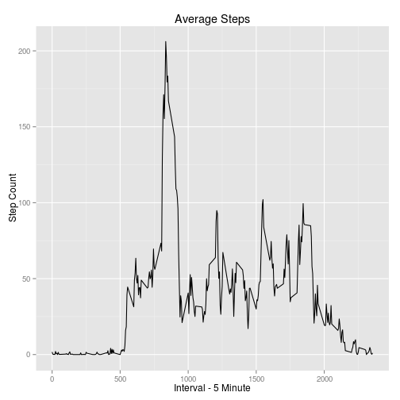
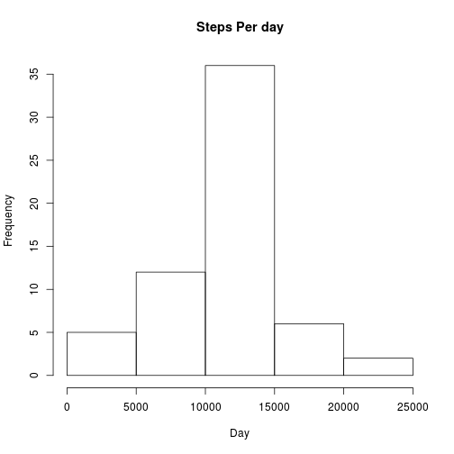
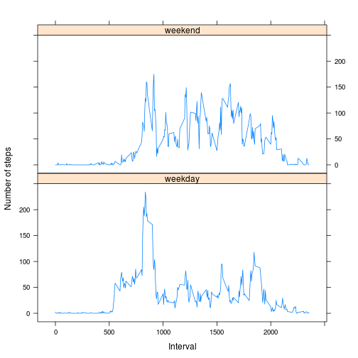

#Load necessary packages


```r
setwd("/home/data/Github/reproducible_research_peer_assesment1")
library(ggplot2)
library(dplyr)
```

```
## 
## Attaching package: 'dplyr'
## 
## The following objects are masked from 'package:stats':
## 
##     filter, lag
## 
## The following objects are masked from 'package:base':
## 
##     intersect, setdiff, setequal, union
```

```r
library(lubridate)
```

#Explore the data


```r
url <-"https://d396qusza40orc.cloudfront.net/repdata%2Fdata%2Factivity.zip"
activity <- read.csv(unz("activity.zip", "activity.csv"), header=T, quote="\"", sep=",")

dim(activity)
```

```
## [1] 17568     3
```

```r
str(activity)
```

```
## 'data.frame':	17568 obs. of  3 variables:
##  $ steps   : int  NA NA NA NA NA NA NA NA NA NA ...
##  $ date    : Factor w/ 61 levels "2012-10-01","2012-10-02",..: 1 1 1 1 1 1 1 1 1 1 ...
##  $ interval: int  0 5 10 15 20 25 30 35 40 45 ...
```

```r
names(activity)
```

```
## [1] "steps"    "date"     "interval"
```

```r
summary(activity)
```

```
##      steps                date          interval     
##  Min.   :  0.00   2012-10-01:  288   Min.   :   0.0  
##  1st Qu.:  0.00   2012-10-02:  288   1st Qu.: 588.8  
##  Median :  0.00   2012-10-03:  288   Median :1177.5  
##  Mean   : 37.38   2012-10-04:  288   Mean   :1177.5  
##  3rd Qu.: 12.00   2012-10-05:  288   3rd Qu.:1766.2  
##  Max.   :806.00   2012-10-06:  288   Max.   :2355.0  
##  NA's   :2304     (Other)   :15840
```
#Processing and Transforming the data


```r
nonaactivity <-na.omit(activity)
nonaactivity$date <- as.Date(nonaactivity$date)
str(nonaactivity)
```

```
## 'data.frame':	15264 obs. of  3 variables:
##  $ steps   : int  0 0 0 0 0 0 0 0 0 0 ...
##  $ date    : Date, format: "2012-10-02" "2012-10-02" ...
##  $ interval: int  0 5 10 15 20 25 30 35 40 45 ...
##  - attr(*, "na.action")=Class 'omit'  Named int [1:2304] 1 2 3 4 5 6 7 8 9 10 ...
##   .. ..- attr(*, "names")= chr [1:2304] "1" "2" "3" "4" ...
```

#Feature Engineering - adding the day column, month and year columns


```r
nonaactivity <- transform(nonaactivity, day = day(nonaactivity$date))
nonaactivity <- transform(nonaactivity, month = month(nonaactivity$date))                                        
nonaactivity <- transform(nonaactivity, year = year(nonaactivity$date))
View(nonaactivity[1:500,])
```

#Provide the sum of total steps as grouped by date


```r
totals <- nonaactivity %>%
         group_by(date) %>%
         summarize(totalsteps = sum(steps))
```

#Create the histogram showing the total number of steps per day


```r
ggplot(nonaactivity, aes(date, steps)) + geom_bar(stat = "identity", colour = "black", fill = "black", width = 0.7) + facet_grid(. ~ month, scales = "free") + labs(title = "Total Number of Steps Each Day Per Month", x = "Date", y = "Total Steps")
```

 

#calculate the mean and the median


```r
mean(totals$totalsteps)
```

```
## [1] 10766.19
```

```r
median(totals$totalsteps)
```

```
## [1] 10765
```

# What is the average daily activity pattern?
Calculate average steps for each of 5-minute interval during a 24-hour period.  
Make a time series plot (i.e. type = “l”) of the 5-minute interval (x-axi) and the average number of steps taken, averaged across all days (y-axis)  
Report which 5-minute interval, on average across all the days in the dataset contains the maximum number of steps?  
Observer and comment the average daily activity pattern


```r
library(plyr)
```

```
## -------------------------------------------------------------------------
## You have loaded plyr after dplyr - this is likely to cause problems.
## If you need functions from both plyr and dplyr, please load plyr first, then dplyr:
## library(plyr); library(dplyr)
## -------------------------------------------------------------------------
## 
## Attaching package: 'plyr'
## 
## The following object is masked from 'package:lubridate':
## 
##     here
## 
## The following objects are masked from 'package:dplyr':
## 
##     arrange, count, desc, failwith, id, mutate, rename, summarise,
##     summarize
```

```r
intervalsteps <- ddply(nonaactivity, ~ interval, summarize,mean=mean(steps))
qplot(x=interval, y=mean, data = intervalsteps,  geom = "line",
      xlab="Interval - 5 Minute",
      ylab="Step Count",
      main="Average Steps"
)
```

 

#Which 5-minute interval, on average across all the days in the dataset, contains the maximum number of steps?


```r
intervalsteps[which.max(intervalsteps$mean), ]
```

```
##     interval     mean
## 104      835 206.1698
```

#Calculate and report the total number of missing values in the dataset


```r
activity_NA <- sum(is.na(activity))
activity_NA
```

```
## [1] 2304
```

#Imputing NAs
Make a histogram of the total number of steps taken each day and Calculate and report the mean and median total number of steps taken per day. 


```r
newsteps <- aggregate(steps ~ interval, data = activity, FUN = mean)
imputdata <- numeric()
for (i in 1:nrow(activity)) {
  obs <- activity[i, ]
  if (is.na(obs$steps)) {
    steps <- subset(newsteps, interval == obs$interval)$steps
  } else {
    steps <- obs$steps
  }
  imputdata <- c(imputdata, steps)
}

imputactivity <- activity
imputactivity$steps <- imputdata

imputsteps <- aggregate(steps ~ date, data = imputactivity, sum, na.rm = TRUE)
```

 


```r
mean(imputsteps$steps)
```

```
## [1] 10766.19
```

```r
median(imputsteps$steps)
```

```
## [1] 10766.19
```

#Are there differences in the weekdays vs weekends?


```r
weekenddata <- nonaactivity 
weekenddata$weekdays <- factor(format(weekenddata$date, "%A"))
levels(weekenddata$weekdays)
```

```
## [1] "Friday"    "Monday"    "Saturday"  "Sunday"    "Thursday"  "Tuesday"  
## [7] "Wednesday"
```

```r
levels(weekenddata$weekdays) <- list(weekday = c("Monday", "Tuesday",
                                                 "Wednesday", 
                                                 "Thursday", "Friday"),
                                     weekend = c("Saturday", "Sunday"))
levels(weekenddata$weekdays)
```

```
## [1] "weekday" "weekend"
```

```r
table(weekenddata$weekdays)
```

```
## 
## weekday weekend 
##   11232    4032
```

```r
stepaverage <- aggregate(weekenddata$steps, 
                         list(interval = as.numeric(as.character(weekenddata$interval)), 
                              weekdays = weekenddata$weekdays),
                         FUN = "mean")
names(stepaverage)[3] <- "meanOfSteps"
library(lattice)
```

 
